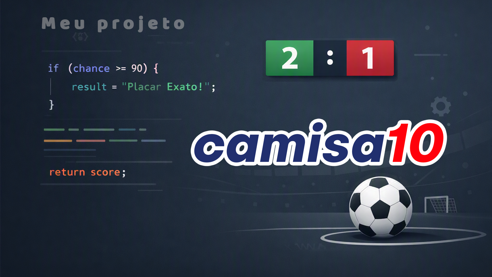
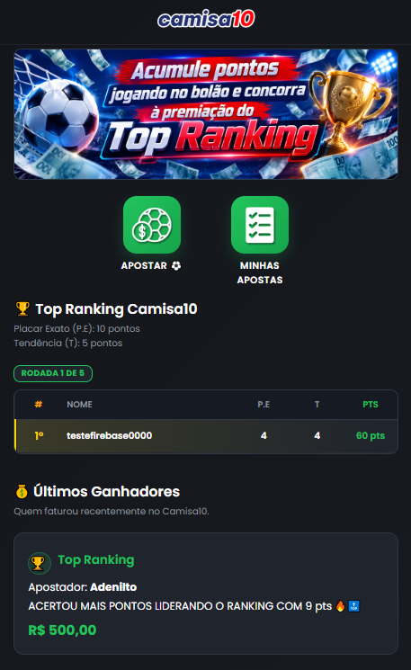
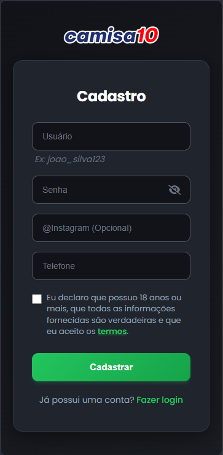
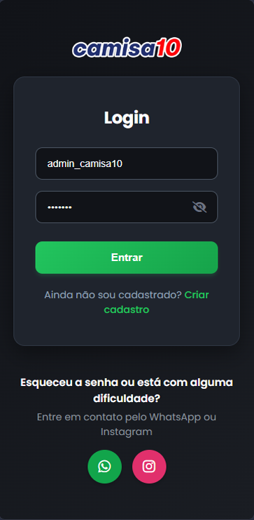
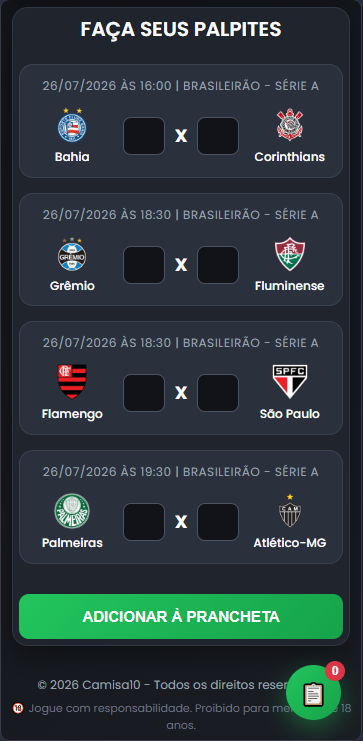
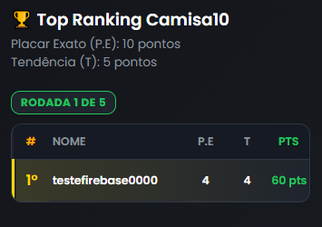
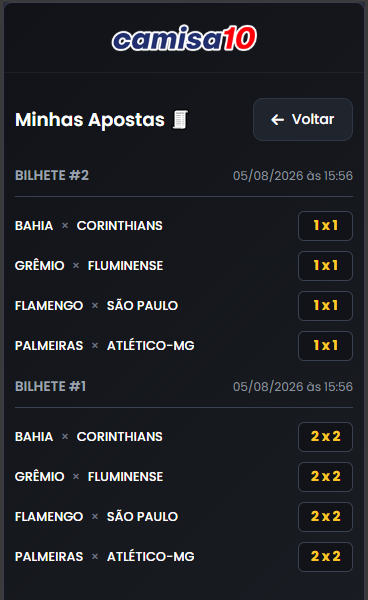
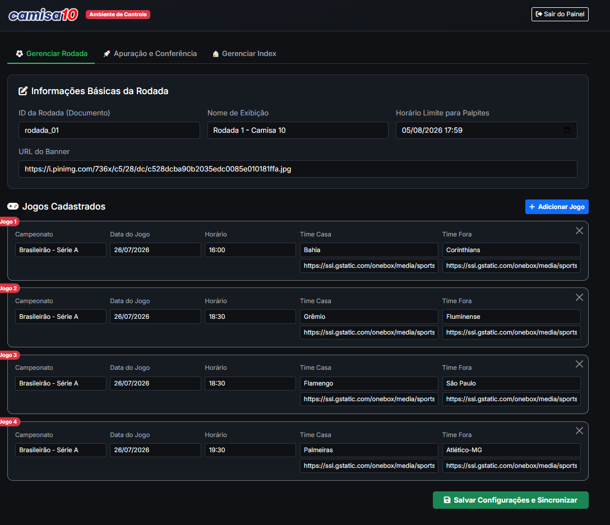
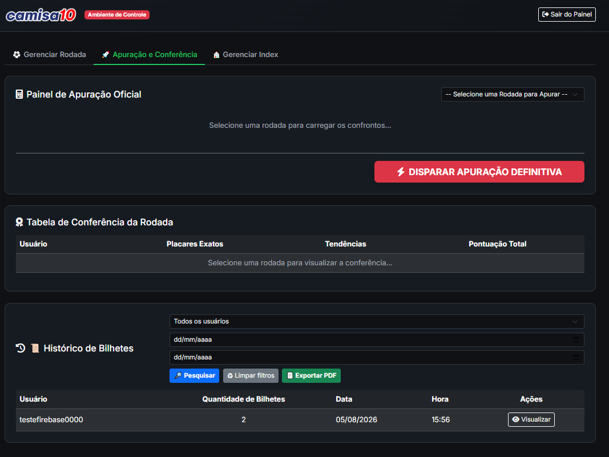

<p align="center">
  
</p>

<h1 align="center">⚽ Camisa10</h1>

<p align="center">
Sistema completo de Bolão Esportivo desenvolvido utilizando HTML, CSS, JavaScript, Firebase, Node.js, Render e Netlify.
</p>

<p align="center">


</p>

---

# 🎥 Demonstração

📺 Vídeo completo do sistema

**https://youtu.be/SEU_VIDEO**

🌐 Sistema Online

**https://apostecamisa10.netlify.app**

---

# 📸 Telas

## Página Inicial



---

## Cadastro



---

## Login



---

## Palpites



---

## Ranking



---

## Histórico



---

## Dashboard



---

## Apuração



---

# 🚀 Funcionalidades

- ✅ Cadastro de usuários
- ✅ Login com Firebase Authentication
- ✅ Recuperação de conta
- ✅ Cadastro de palpites
- ✅ Múltiplos bilhetes
- ✅ Ranking Geral
- ✅ Histórico de apostas
- ✅ Dashboard Administrativo
- ✅ Gerenciamento de rodadas
- ✅ Apuração automática
- ✅ Pagamentos via Pix
- ✅ Integração com Mercado Pago

---

# 🛠 Tecnologias

## Front-end

- HTML5
- CSS3
- JavaScript

## Back-end

- Node.js
- Express

## Banco de Dados

- Firebase Firestore

## Autenticação

- Firebase Authentication

## Hospedagem

- Netlify
- Render

## Pagamentos

- Mercado Pago

---

# 🏗 Arquitetura


---

# 📁 Estrutura

```text
camisa10/

📁 admin
📁 css
📁 dashboard
📁 docs
📁 historico
📁 img
📁 info
📁 js
📁 pag_palpites

📄 index.html
📄 firebase.js
📄 README.md
```

---

# 🔐 Segurança

- Firebase Authentication
- Firestore Rules
- Backend separado
- Firebase Admin SDK
- Variáveis de ambiente no Render
- Tokens privados protegidos

---

# ⚙ Como executar

Clone o projeto

```bash
git clone https://github.com/amomq1/camisa10.git
```

Abra o projeto em um servidor local.

O backend necessita das seguintes variáveis de ambiente:

```env
FIREBASE_SERVICE_ACCOUNT=

MERCADO_PAGO_ACCESS_TOKEN=

MERCADO_PAGO_COLLECTOR_ID=

APP_URL=
```

---

# 📌 Sobre o Projeto

O Camisa10 foi desenvolvido com o objetivo de oferecer uma plataforma completa de bolão esportivo, permitindo que usuários realizem palpites, acompanhem rankings em tempo real e participem de competições organizadas de maneira simples, rápida e segura.

---

# 👨‍💻 Desenvolvedor

**Amom Queiroz**

Tecnólogo em Análise e Desenvolvimento de Sistemas

GitHub

https://github.com/amomq1

LinkedIn

*(adicione seu LinkedIn aqui)*

---

## ⭐ Se este projeto foi útil, deixe uma estrela no repositório.
